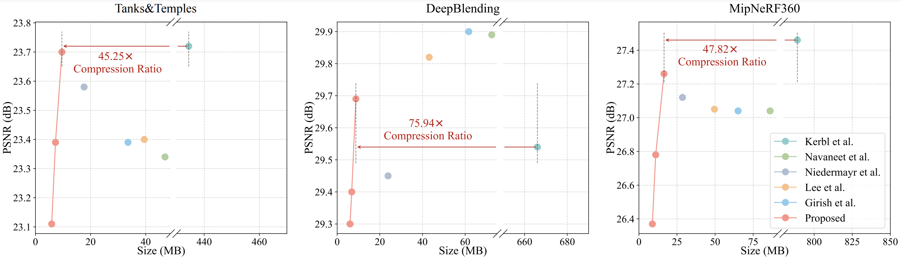
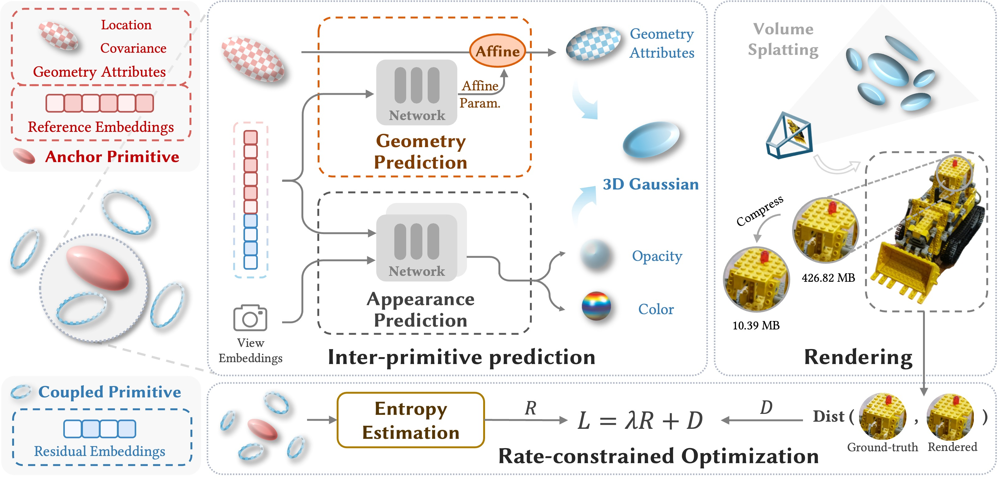

source code for our work "CompGS: Efficient 3D Scene Representation via Compressed Gaussian Splatting"



---

# Overview


# Preparation

## Download dataset
We evaluate our method on the following datasets:
- [Tanks&Temples](https://repo-sam.inria.fr/fungraph/3d-gaussian-splatting/datasets/input/tandt_db.zip)
- [Deep Blending](https://repo-sam.inria.fr/fungraph/3d-gaussian-splatting/datasets/input/tandt_db.zip)
- [MipNeRF360](https://jonbarron.info/mipnerf360/)

Please download the datasets and unzip them.


## Installation dependencies
1. Clone the repository
    ```bash
    git clone git@github.com:LiuXiangrui/CompGS.git
    ```
2. Install Pytorch and other dependencies specified in the requirements.txt
3. Install KNN and Splatting modules
    ```bash
    SET DISTUTILS_USE_SDK=1 # Windows only
    cd CompGS/submodules/knn_dist
    pip install .
    cd ../diff-gaussian-rasterization
    pip install .
    ```
4. Compile GPCC

   > Please download the GPCC source code from [here](https://github.com/MPEGGroup/mpeg-pcc-tmc13) and then compile it. 

# Train and evaluate our method
- Please refer to ```Sripts/derive_train_eval_scripts``` for training and evaluation scripts.

- Note that you need to modify the paths in the scripts to your own paths.
  - `trainer_path`: path of the Train.py file (absolute path is recommended)
  - `gpcc_codec_path`: path of the GPCC codec executable file (absolute path is recommended)
  - `dataset_root`: path of the dataset (absolute path is recommended)
  - `experiments_root`: path to save the experiments (absolute path is recommended)
  - `config_path`: path of the config file (absolute path is recommended)

- Then you can run the script ```run.bat``` of ```run.sh``` (depends on your system) to train and evaluate our method.
- After the evaluation, you can find the results in the ```experiments_root/config_name/experiment_folder/eval/results.json``` file. The results will include:
  - `decompression_time`: time for decompression in minutes.
  - `per_view`: quality scores for each view.
  - `average`: average quality scores.
  - `render_time`: time for rendering each view in milliseconds.
  - `num_gaussians`: number of anchor primitives.
  - `training_time`: time for training in minutes. 
  - `file_size`: bitstream size in bytes, including size of each component.
  - `compression_time`: time for compression in minutes.

# Render based on compressed models
You can render novel views from compressed models by running ```Test.py```

Here is an example of rendering on the _Train_ scene of Tanks&Temples dataset:
```bash
python Test.py --dataset_root D:\T2T\Datasets\Train --experiment_root D:\T2T\Results\Train\Lambda0_001\2024-04-07_16-57 \\
               --voxel_size=0.01 --derive_factor=10 --ref_feats_dim=32 --ref_hyper_dim=4 --res_feats_dim=8 --res_hyper_dim=1 \\
               --gpcc_codec_path=C:\Users\XiangruiLIU\Desktop\mpeg-pcc-tmc13\build\tmc3\Release\tmc3.exe
```

# Acknowledgment
:heart::heart::heart: This work is implemented based on the following projects. 

We really appreciate their wonderful open-source work!

- [3DGS](https://github.com/graphdeco-inria/gaussian-splatting)
- [Scaffold-GS](https://github.com/city-super/Scaffold-GS)
- [Compact3D](https://github.com/UCDvision/compact3d)
- [c3dgs](https://github.com/KeKsBoTer/c3dgs)
- [Compact-3DGS](https://github.com/maincold2/Compact-3DGS)
- [EAGLES](https://github.com/Sharath-girish/efficientgaussian)

# Citation
If you find our work useful in your research, please consider citing:
```bibtex
@inproceedings{liu2024compgs,
  title={CompGS: Efficient 3D Scene Representation via Compressed Gaussian Splatting},
  author={Liu, Xiangrui and Wu, Xinju and Zhang, Pingping and Wang, Shiqi and Li, Zhu and Kwong, Sam},
  booktitle={Proceedings of the 32nd ACM International Conference on Multimedia},
  year={2024}
}
```
